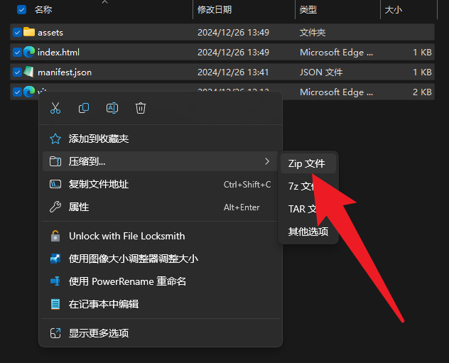
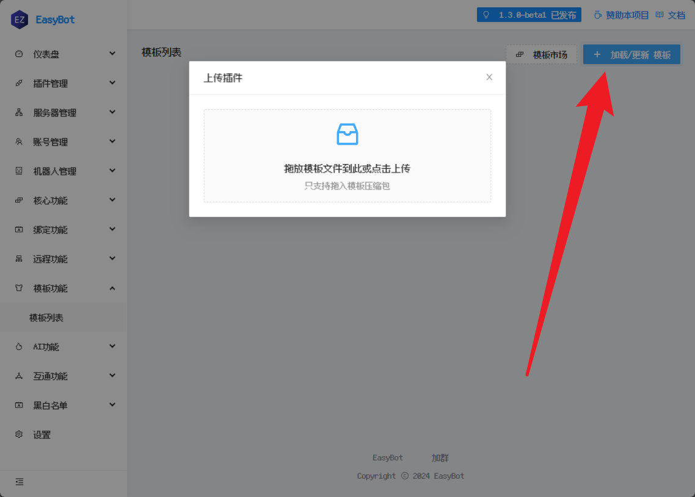
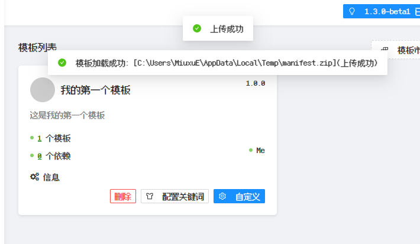
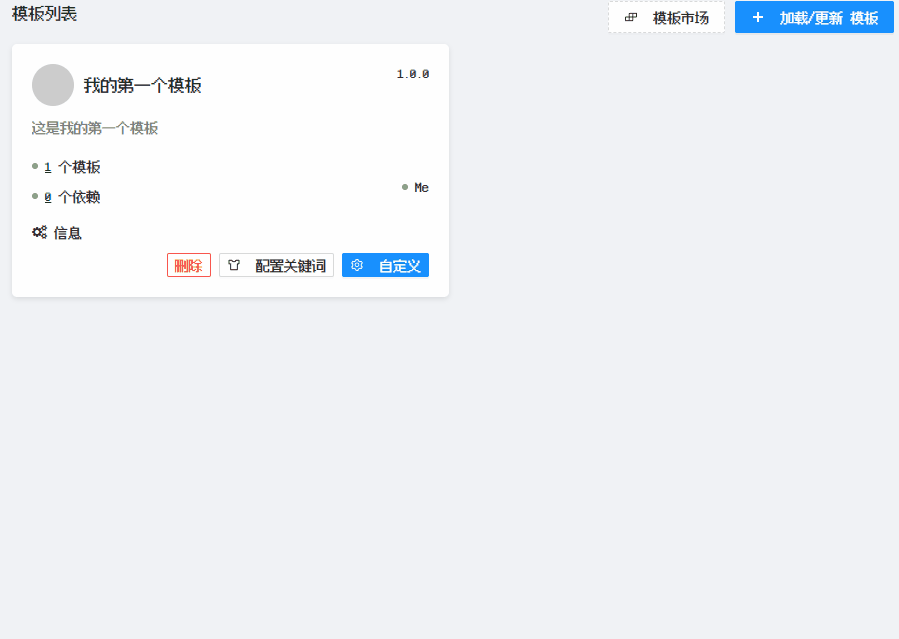
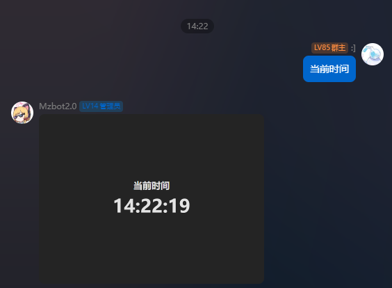

# EasyBot时间图片模板

主要用来演示如何开发

## 打包

```bash
npm i
npm run build
```

打包的结果在`dist`目录下,你需要进入目录,全选文件,然后右键压缩成zip文件



## 在EasyBot加载本模板

确认一切无误后,打开EasyBot的模板管理页面,将打包好的zip文件上传即可




## 配置关键词

关键词是EasyBot识别模板的关键,你可以在模板管理页面中配置关键词,当用户在群聊内发送对应消息时,模板会触发


## 测试

